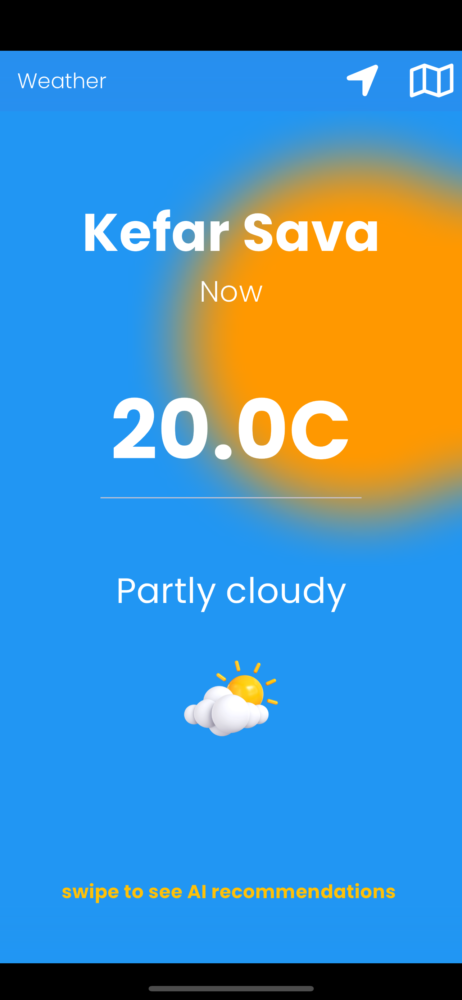

# WeatherApp

## Overview

Welcome to the WeatherApp, a Flutter-based weather application that provides users with detailed weather information for their current location and any other place in the world. The app leverages clean code principles and follows a well-organized folder structure to ensure maintainability and scalability.

## Features

- **Current Location Weather**: Get real-time weather details for your current location.
- **Global Weather Search**: Search for weather information in any place around the world using Google Maps.
- **WeatherAPI Integration**: The app uses the 'weatherapi' from [www.weatherapi.com](https://www.weatherapi.com) to fetch accurate and up-to-date weather data.
- **ChatGPT Integration**: Enhance user experience with explanations of the weather in simple human words. The ChatGPT API is utilized to provide personalized recommendations, including what to wear based on the weather conditions.

## Installation

1. Clone the repository:

```bash
git clone https://github.com/eldad-assaf/weather_app.git
```

2. Navigate to the project directory:

```bash
cd weather_app
```

3. Create a `.env` file in the root of the project and add the following:

```
WEATHER_API_KEY = your_weatherapi_key
CHAT_API_KEY = your_chatgpt_api_key
```

4. Install dependencies:

```bash
flutter pub get
```

5. Run the app:

```bash
flutter run
```


## License

This project is licensed under the [MIT License](LICENSE).

---

Enjoy using the WeatherApp! If you have any questions or encounter issues, please don't hesitate to reach out. Happy coding!

<p float="left">
  
  
  
  

</p>